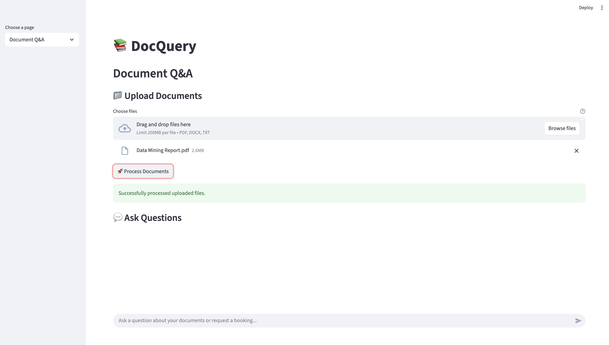
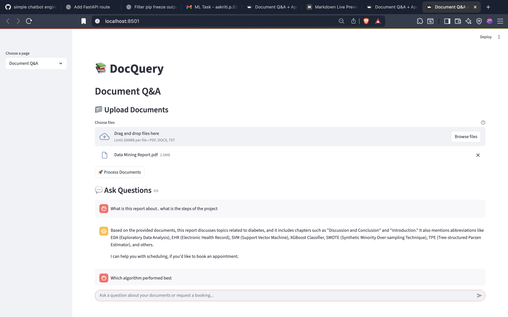
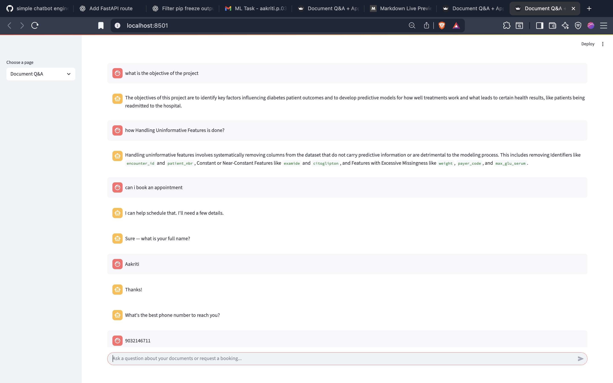
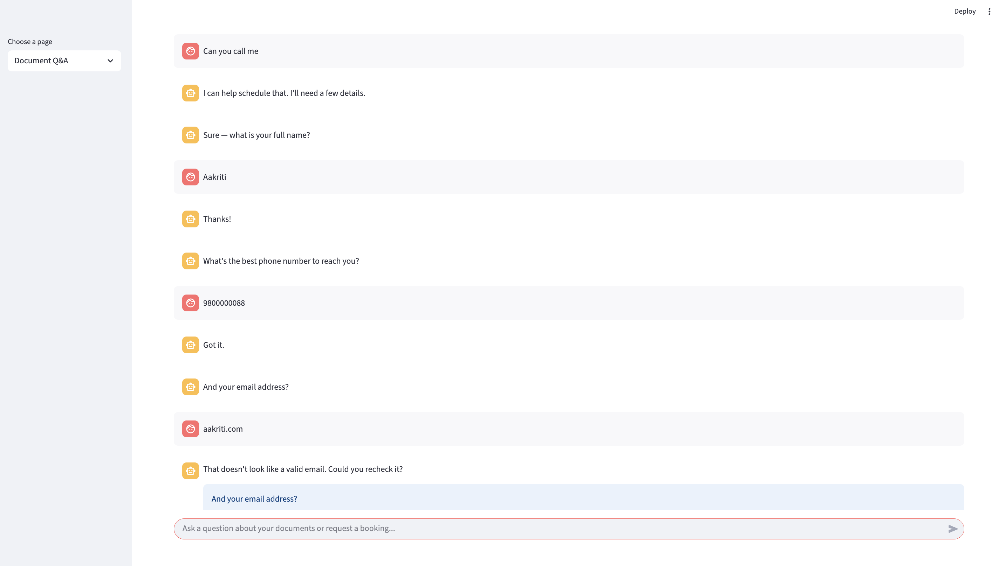
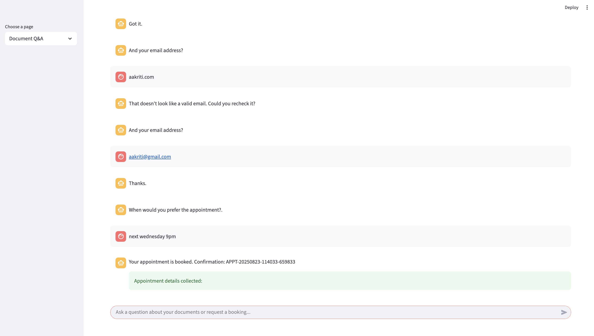
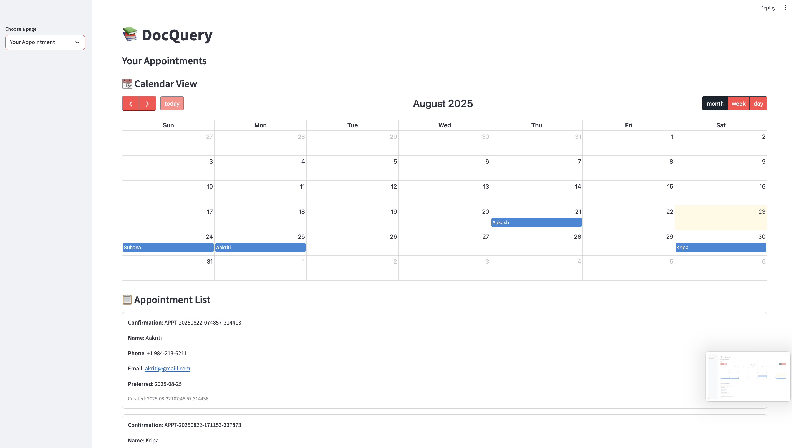

# Document Query Bot 🤖📚

A smart chatbot that can answer questions from your documents and help book appointments. Built with Python, FastAPI, and LangChain.

## ✨ Features

- **📄 Document Q&A**: Upload documents (PDF, DOCX, TXT) and ask questions
- **🧠 Smart Intent Detection**: Automatically detects if you want to ask questions or book appointments
- **📅 Appointment Booking**: Conversational form to schedule appointments
- **🔍 Vector Search**: Uses ChromaDB for fast, accurate document retrieval
- **🌐 Web API**: RESTful API endpoints for easy integration
- **💬 Chat Interface**: Maintains conversation context and history

## 🚀 Quick Start

### Prerequisites
- Python 3.8+
- Google AI API key (for Gemini model)

### Installation

1. **Clone the repository**
   ```bash
   git clone <your-repo-url>
   cd DocumentQuery-Bot
   ```

2. **Create virtual environment**
   ```bash
   python -m venv venv
   source venv/bin/activate  # On Windows: venv\Scripts\activate
   ```

3. **Install dependencies**
   ```bash
   pip install -r requirements.txt
   ```

4. **Set up environment variables**
   ```bash
   export GOOGLE_API_KEY="your-api-key-here"
   ```

5. **Run the Backend**
   ```bash
   python src/main.py
   ```

6. **Run Frontend**
    ```bash
    streamlit run src/app.py
    ```

## 📁 Project Structure

```
DocumentQuery-Bot/
├── src/
│   ├── api/                 # FastAPI routes and schemas
│   ├── chatbot/            # Core chatbot logic
│   │   ├── agent/          # Date extraction and tools
│   │   ├── core/           # Chat engine and document processing
│   │   └── form/           # Conversational forms
│   ├── chroma_db/          # Vector database storage
│   ├── appointments/        # Appointment data
│   ├── app.py              # FastAPI application
│   └── main.py             # Main entry point
├── test/                   # Test suite
├── documents/              # Document storage and images
└── requirements.txt        # Python dependencies
```

## 🔧 How It Works

### 1. Document Processing
- Upload documents through the API
- Documents are chunked and embedded using HuggingFace embeddings
- Stored in ChromaDB vector database for fast retrieval

### 2. Intent Detection
- Uses LLM to classify user intent:
  - **"qa"**: Document question answering
  - **"appointment,contact"**: Book appointment 

### 3. Question Answering
- Retrieves relevant document chunks using vector similarity
- Generates answers using Google's Gemini model

### 4. Appointment Booking
- Conversational form collects:
  - Name, Phone, Email
  - Preferred date/time
- Stores appointment data in JSON format

## 📡 API Endpoints

| Endpoint | Method | Description |
|----------|--------|-------------|
| `/` | GET | Welcome message |
| `/health` | GET | Health check |
| `/status` | GET | System status |
| `/upload-documents` | POST | Upload documents |
| `/ask` | POST | Ask questions |


### Book Appointment
Just say: *"I'd like to book an appointment"* or *"Can you call me?"*

## 🧪 Testing

Run the test suite to verify everything works:

```bash
# Activate virtual environment
source venv/bin/activate

cd test

# Run all tests
python run_tests.py

# Run specific test modules
python test_intent.py
python test_routes.py
```


## 🛠️ Dependencies

- **LangChain**: LLM integration and chains
- **FastAPI**: Web framework
- **ChromaDB**: Vector database
- **HuggingFace**: Text embeddings
- **PyPDF2**: PDF processing
- **python-docx**: DOCX processing

## 📸 Screenshots

###  Upload Interface


###  Document Q&A


### Conversational Form


### Input Validation


### Appointment Booking 


### 🗓️ Appointment Display


## 🤝 Contributing

1. Fork the repository
2. Create a feature branch
3. Make your changes
4. Add tests for new functionality
5. Submit a pull request
 

##  Support

If you encounter issues:
1. Check the test suite: `python test/run_tests.py`
2. Verify your API key is set correctly
3. Ensure all dependencies are installed in your virtual environment
4. Check the logs for error messages

---

**Built using Python, FastAPI, and LangChain**
